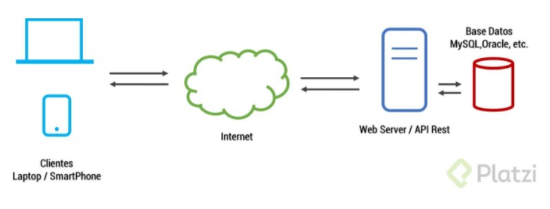

# Servicios web en Android

*Siempre que necesitemos construir una aplicación móvil donde sus datos no permanezcan en la app, necesitamos información traída de internet. En este caso usando __Servicios Web__*

- **Servicio web**
> Un servicio web (en inglés, web service o web services) es una tecnología que utiliza un conjunto de protocolos y estándares que sirven para intercambiar datos entre aplicaciones. Distintas aplicaciones de software desarrolladas en lenguajes de programación diferentes, y ejecutadas sobre cualquier plataforma, pueden utilizar los servicios web para intercambiar datos en redes de ordenadores como Internet.

## ¿Cómo funciona un servicio web?

De acuerdo con la imagen, vemos 4 elementos que intervienen en la comunicación de los datos.

1. Clientes
2. Internet
3. Servidor web 
4. Bases de datos 

### 1. Clientes

Son todas las aplicaciones que necesitan mostrar datos, pueden ser aplicaciones móviles, un sitio web o aplicaciones de escritorio.

Los clientes se encargan de hacer peticiones al servidor, para que le devuelva datos para poder mostrarlos a los usuarios.

La información recibida debe ser simple y ordenada, en donde se usa JSON (Javascript Object Notation) ó XML (eXtensible Markup Languaje), que son formatos o formas de presentar la información.

### 2. Internet

Es el puente de comunicación entre el cliente y cualquier otra cosa, es el camino donde se difunde la información, y se hace a través del protocolo HTTP/HTTPS. HTTPS es un protocolo que permite que la información viaje encriptada y significa **(Hypertext Transfer Protocol Secure) HTTPS**

### 3. Servidor Web

Es el encargado de controlar  las entradas y salidas, conocidos como **request** (peticion) y **response** (respuestas).

Estos servidores tienen la lógica para poder hacer peticiones a la base de datos y poder enviar la información a quien lo esté solicitando. Generalmente estos servicios web, usan el estandar **API REST**.

El punto de entrada a la API es por la **URI (Uniform Resource Identifier)** un identificador de recursos únicos que contiene la URL (Uniform Resource Locator) el localizador de recursos, así cuando el cliente le haga una petición por medio de la URI, el servidor sabrá que datos está solicitando.

### 4. Bases de datos

Son los encargados de almacenar la información, por esta razón debe estar sumamente cuidada y estructurada para que esté segura y sea eficaz a la hora de consultar los datos.

La base de datos puede estar construida en sistemas de gestión de base de datos como
 **MySQL, Oracle, PostgreSQL, SQL SERVER**, etc.

 Las bases de datos contendrán la información de la lógica de negocio de nuestro proyecto, que en algunos casos puede ser demasiada, que no puede almacenarce en la memoria del teléfono. Sin embargo, de debe considerar mantener sólo información necesaria para mantener la persistencia así no haya internet.