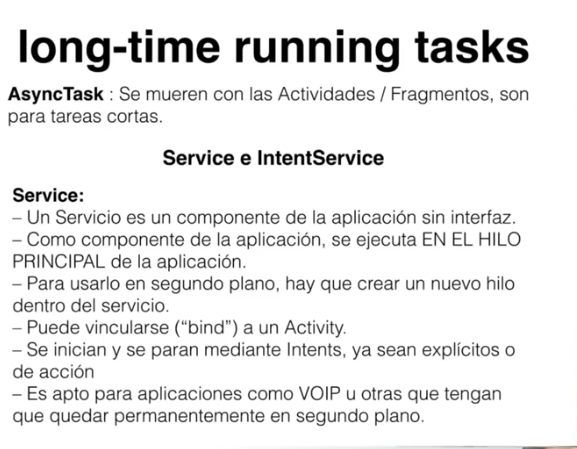
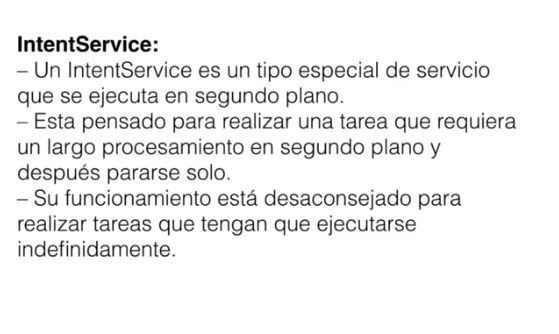
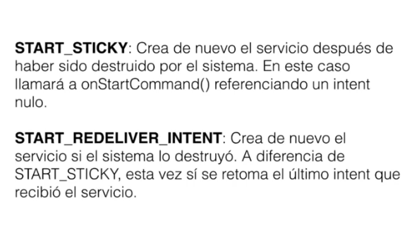

# Services

Un servicio es un elemento que lleva a cabo operaciones de larga duración en segundo plano y sin ninguna clase de interfaz.

Son de gran utilidad para acciones como:

- Sincronizar aplicaciones con la nube.
- Administrar Notificaciones Push (Firebase Cloud Messaging, Parse, etc.).
- Monitorear información.
-  Reproducir música sin tener contacto directo con la interfaz.
- Almacenar información en la base de datos.
- Gestionar escritura y lectura de archivos.
- y muchas más…

Su gran ventaja está en que *ejecutan operaciones en segundo plano*, es decir, cuando el usuario no tiene contacto directo con tu aplicación. A diferencia del uso de *tareas asíncronas*, las cuales se *ejecutan solo si la aplicación está activa*.

Si el usuario cambia hacia otra aplicación, el servicio seguirá activo hasta que cumpla su objetivo o sea terminado por el sistema, debido a la falta de recursos.

## long-time running task

Sirven para crear servicios o tareas, no necesariamente dentro de actividades, si no en hilos separados.

- **AsyncTask** Se mueren con las actividades/Fragmentos, son para tareas cortas.

**Tipos de Services**

- Service
- IntentService

Un service, no tiene acceso a interfaz, no tiene acceso a botones ni cosas por ese estilo, se ejecuta en otro hilo para hacer tareas de segundo plano

**Service**



**IntentService**




Para usar los servicios, debemos agregarlos el tag `<service>` al manifest de nuestra aplicación.
```xml
<service
	name="com.miapp.id.myservice"
	label="@string/service_label">

	<intent-filter>
		<action android:name="com.miapp.id.action.ACTION_OPEN_SERVICE"/>
	</intent-filter>
	
</service>
```

Con esto determinamos cuando corre el servicio, por ejemplo si se ejecuta cuando se abre la aplicación, o cuando el teléfono prende por primera vez.

*Para más información ver el siguiente artículo* [Crear un servicio en android](http://www.hermosaprogramacion.com/2015/07/tutorial-para-crear-un-servicio-en-android/)

Los servicios, se ejecutan de la siguiente manera.

```java
Intent intent = new Intent(this, MyService.class); 
startService(intent);

Intent intent = new Intent("com.miapp.id.action.ACTION_OPEN_SERVICE");
startService(intent);
```

Un servicio se compone de los siguientes métodos, o ciclo de vida.

```java
public class DownloadService extends Service {

	public DownloadService(){
	}

	@Override
	public IBinder onBind(Intent intent){
		return null;
	}

	@Override 
	public void onCreate(){
		Log.d(TAG, 	"Servicio creado...");
	}

	@Override
	public int onStartCommand(Intent intent, int flags, int startId){
		Log.d(TAG, 	"Servicio iniciado...");

		return START_NOT_STICKY;
	}

	@Override
	public void onDestroy(){
		Log.d(TAG, 	"Servicio destruido...");
	}

}
```

Tipos de estados de los servicios 



## Crear un Servicio en Android

Para crear un servicio en android, debemos dar clic derecho sobre el paquete y dar en new Service. Es igual que cuando vamos a crear una actividad.

Automáticamente, crea la estructura y agrega en el manifest la etiqueta del servicio.

Los servicios tienen sus propios contextos.
Solo se ejecuta un servicio a la vez.

Iniciar un servicio desde otro componente es fácil, usando el método `startService()`
```java
startService(new Intent(this, Servicio.class));
```

Del mismo modo, puedes terminar su ejecución con el método `stopService()`:
```java
stopService(new Intent(this, Servicio.class));
```


## IntentService 

A diferencia de Service, IntentService no ejecuta varias instancias al mismo tiempo si es llamado múltiples ocasiones.

Lo que haces es dejar en cola los intents que van llegando y así ejecutarlos de forma secuencial.


El trabajo será ejecutado dentro del método onHandleIntent() y no en onStartCommand(). Este método recibe como parámetro un intent que puede traer una acción asociada y parámetros que indiquen que decisión tomar.

```java 
@Override
protected void onHandleIntent(Intent intent) {
    if (intent != null) {
        // Acciones por realizar...
    }
}
```

Puntos a tener en cuenta:

* No es necesario sobrescribir onBind(). IntentService ya lo trae implementado con retorno null.
* Tampoco se debe llamar a stopSelf(), ya que el servicio se detiene automáticamente cuando despacha la cola de intents en proceso.
* Define constantes para acciones y parámetros que se asocien a los intents que recibe o envía el servicio. Con ello puedes decidir qué acción tomar dentro de onHandleIntent() y comunicar datos. Un ejemplo son las acciones FOO y BAZ del Intent Service de arriba, las cuales traen un método personalizado de manejo tipo handleAction*().


Para modificar el estilo de la aplicación y eliminar la action bar de nuestra actividad se usa el estilo padre `Theme.AppCompat.NoActionBar`.

## MemoryService (Service)

**EXTRA_MEMORY** se refiere a la cantidad de memoria disponible que se notificará. Y **EXTRA_PROGRESS** al progreso que se da en el segundo servicio.

A través del `LocalBroadcastManager`. Este elemento emite un mensaje en forma de intent hacia los elementos de nuestra aplicación con el método `sendBroadcast()`.

Importante resaltar que en `onDestroy()` cancelamos la timer task, ya que no deseamos que se ejecute indefinidamente. Además emitimos la acción de terminación del servicio para que la actividad tome la decisión necesaria.

## ProgressIntentService (IntentService) con Progress notification

Las acciones se incluyeron en onHandleIntent() como vimos en los apartados anteriores.

Dentro de este método comprobamos que la acción del intent sea `Constants.ACTION_RUN_ISERVICE`. Si es así, entonces iniciamos el método handleActionRun().

`handleActionRun()` se encarga de:

- Crear una notificación para mostrar cuando se invoque `startForeground()`.
- Iniciar un bucle que simula una operación que tarda 10 segundos en terminar.
- Actualizar el progreso de la notificación con setProgress()
- Enviar el progreso hacia la actividad a través del LocalBroadcastManager.
- Quitar el servicio de primer plano con stopForeground() al terminar el bucle.

Dentro de `onDestroy()` se envía la señal de terminación del servicio.

## Declarar los servicios en el Manifest 

```xml
<service
    android:name=".MemoryService"
    android:enabled="true"
    android:exported="true" >
</service>
<service
    android:name=".ProgressIntentService"
    android:exported="false" >
</service>
```

## Activar servicios desde la actividad 

Poner a correr los servicios cuando los botones sean presionados. Esto se lleva a cabo con `startService()` dentro de las respectivas escuchas.

Ten en cuenta que para recibir los intents emitidos desde los servicios es necesario registrar un `BroadcastReceiver` asociado a la actividad. Éste elemento se comporta como una especie de antena que recibe señales, que si se ajusta a las frecuencias necesarias (acción del intent), podrá recibir información de otros componentes.


¿Que se hizo para que la actividad recibiera los mensajes?

* Declarar un BroadcastReceiver interno y sobreescribir el controlador `onReceive()`. Dentro de se usa un switch para tomar decisiones basado en las acciones del intent entrante.
* Dentro de `onCreate()` se intanció un `IntentFilter`, el cual contiene las acciones por las que estaremos pendientes.
- Se creó una nueva instancia del broadcast receiver y luego se registró su presencia con el método `LocalBroadcastManager.registerReceiver()`, asociando los filtros que deseamos que coincidan con las señales entrantes.


> Los servicios nos permiten construir aplicaciones más avanzadas que provean mejores características a nuestros usuarios y que mantenga la integridad de la información.