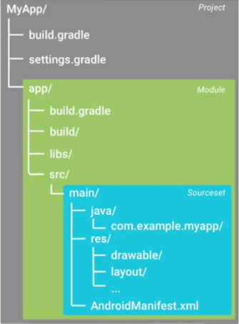

# Arquitectura en Aplicaciones Android

Android está dividido en 4 grandes partes:

## 1. Linux Kernel (Base)""
Garantiza que el teléfono puede hacer las funciones básicas de cualquier computadora. Por ejemplo acceder al wi-fi, las cámaras, acceder al flashdriver, etc. 

Cuando se rootean los teléfonos, nos saltamos esta capa de seguridad y accedemos directamente al kernel, donde se pueden modificar aplicaciones, acceder a archivos privados, etc. Lo cuál genera una vulnerabilidad y puede hacer que los virus afecten a los teléfonos.

## 2. Libraries ""
Se encuentran librerías para usarlas a nivel de sistema operativo. Por ejemplo librerías como *OpenGL, SQLite, WebKit, SSL*. 

Dentro de esta capa de encuentra tambipen el **Android Runtime**, en donde encontramos: *CoreLibs y Dailvik Art o el Runtime acual*. Estas librerías  tienen las conexiones para accerder al Linux Kernel, mediante el Application Framework, para que las aplicaciones se puedan ejecutar en entornos Java, mediante una máquina virtual. Tal como funciona Java en entorno de escritorio.

## 3. Application Framework ##
Son las librerías MiddleWare para construir nuestras aplicaciones. Dentro de esta capa encontramos, el *activityManager, LocationManager, Package Manager, NotificationManager, etc.*

## 4. Application ##
Esta última capa, es donde generalmente los fabricantes de teléfonos utilizan para personalizar el home, la aplicación de contactos, browser, etc.

## Application Building Blocks
- **Activity**
Ui component typically corresponding to one screen
- **IntentReceiver**
Responds to notification or status changes. Can wake up your process.
- **Service**
Faceless tasks runs in the background
- **ContentProvider**
Enable applications to share data.

## Estructura de Proyecto en Android

Las carpetas usadas en android generalmente son:
- **Carpeta build** Los elementos que contiene son códigos generados automáticamente por Android Studio cada vez que se realiza la compilación de nuestro proyecto.
- **Carpeta libs** Contiene las librerías Java externas que utiliza nuestra aplicación. Android Studio hace referencia a estas librerías en el fichero build.gradle 
- **Carpeta srs** Contiene la información más importante, y es la que contiene la estructura de una aplicación Android (Código fuente)
- **Carpeta drawable** Aquí se guardan las imágenes que se usen en la aplicación.
- **Carpeta layout** Se encuentras los archivos de las vistas como el activity_main.xml. Éstos contienen el diseño de las interfaces.
- **Carpeta menu** Se crea automáticamente, y contiene un menú básico para las actividades.
- **Carpeta values** Aquí encontraremos los archivos `dimens.xml, styles.xml y strings.xml`

# Formas de Trabajar una Arquitectura para los proyectos en Android

Los estilos de arquitectura se basan principalmente en el ciclo de vida de  las actividades.

Básicamente hay dos formas muy utilizadas para organizar nuestra aplicación.
- **MVC (Modelo Vista Controlador)**
	- Model: Qué renderizar
	- View: Cómo renderizar
	- Controller: Eventos y entradas de usuario.
- **MVP (Modelo Vista Presentador)**
En este tipo de arquitectura el modelo no actúa directamente con la vista, todo sucede en un Presentador que es el encargado de ejecutar acciones de acuerdo a eventos presentados en la vista o el modelo. 
